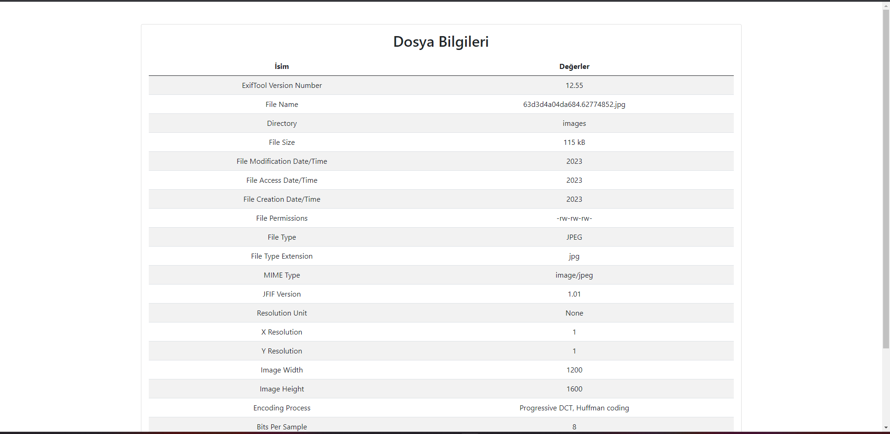

# ImageDetails
gives information about the image you uploaded

Note: Exiftool software must be installed if you are using Windows operating system. You also need to define the path to Exiftool in environment variables

